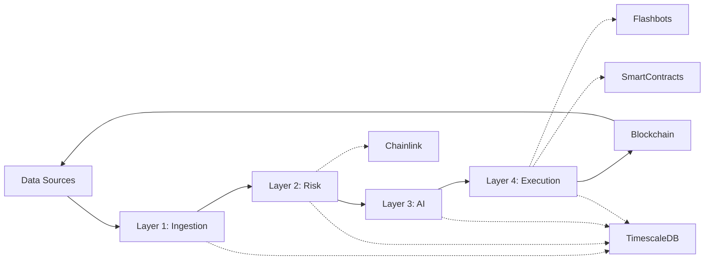

# AI-Yield-Rebalancer: Complete Architecture Diagram

## System Overview

This document provides a comprehensive visual representation of the AI-Yield-Rebalancer system architecture, showing all layers, components, and data flows.

---

## 1. High-Level 4-Layer Architecture

```
┌─────────────────────────────────────────────────────────────────────────────┐
│                                                                             │
│  ┌──────────────────┐    ┌──────────────────┐    ┌──────────────────┐    │
│  │   LAYER 1        │    │    LAYER 2       │    │    LAYER 3       │    │
│  │                  │    │                  │    │                  │    │
│  │  DATA INGESTION  │───▶│  RISK ASSESSMENT │───▶│  AI INFERENCE    │    │
│  │  ("Eyes")        │    │  ("Safety")      │    │  ("Brain")       │    │
│  │                  │    │                  │    │                  │    │
│  └──────────────────┘    └──────────────────┘    └──────────────────┘    │
│          │                       │                       │                 │
│          └───────────────────────┴───────────────────────┘                 │
│                                  │                                         │
│                          ┌────────▼────────┐                              │
│                          │   LAYER 4       │                              │
│                          │                 │                              │
│                          │  EXECUTION      │                              │
│                          │  ("Hands")      │                              │
│                          │                 │                              │
│                          └────────┬────────┘                              │
│                                   │                                        │
│                          ┌────────▼─────────┐                            │
│                          │   BLOCKCHAIN    │                             │
│                          │  (Smart Contracts)                            │
│                          └──────────────────┘                            │
│                                                                             │
└─────────────────────────────────────────────────────────────────────────────┘
```

---

## 2. Detailed Layer Architecture

### LAYER 1: DATA INGESTION ("Eyes")

```
┌─────────────────────────────────────────────────────────────────────────┐
│                         EXTERNAL DATA SOURCES                           │
│                                                                         │
│  ┌─────────────┐  ┌─────────────┐  ┌──────────────┐  ┌─────────────┐ │
│  │ DeFiLlama   │  │    Dune     │  │   Alchemy    │  │   The Graph │ │
│  │   API       │  │  Analytics  │  │   RPC API    │  │  Subgraphs  │ │
│  └──────┬──────┘  └──────┬──────┘  └──────┬───────┘  └──────┬──────┘ │
│         │                │                 │                │          │
└─────────┼────────────────┼─────────────────┼────────────────┼──────────┘
          │                │                 │                │
          │                └─────────────────┼────────────────┘
          │                                  │
┌─────────┴──────────────────────────────────┴────────────────────────────┐
│                    DATA AGGREGATOR SERVICE                              │
│                   (src/data/defillama_client.py                        │
│                    src/ingestion/*.py)                                 │
│                                                                         │
│  ┌──────────────────────────────────────────────────────────────────┐  │
│  │  • Poll DeFiLlama for yields (top stablecoin pools)             │  │
│  │  • Fetch Dune Analytics historical volatility metrics           │  │
│  │  • Monitor Chainlink oracle feeds for de-pegging signals        │  │
│  │  • Normalize data into common feature vector format             │  │
│  │  • Handle rate-limiting and retry logic                        │  │
│  └──────────────────────────────────────────────────────────────────┘  │
└─────────────────────────────┬───────────────────────────────────────────┘
                              │
        ┌─────────────────────┼─────────────────────┐
        │                     │                     │
        ▼                     ▼                     ▼
┌──────────────────┐ ┌──────────────────┐ ┌──────────────────┐
│  TimescaleDB     │ │   Redis Cache    │ │  Feature Vector  │
│  (Storage)       │ │   (Hot Data)     │ │  (Normalized)    │
│                  │ │                  │ │                  │
│  • Hypertables   │ │  • TTL: 1 day    │ │  • 32+ features  │
│  • Historical    │ │  • Real-time data│ │  • Normalized    │
│  • Data history  │ │  • Fast retrieval│ │  • Ready for ML  │
└──────────────────┘ └──────────────────┘ └──────────────────┘
        │
        └────────────────────────────────────────────────┐
                                                         │
                                            ┌────────────▼──────────┐
                                            │  LAYER 2 INPUT        │
                                            │  (Risk Assessment)     │
                                            └───────────────────────┘
```

**Key Components:**
- `defillama_client.py` - Fetches yield data
- `ingestion/` - Data normalization pipeline
- `data/` - Storage layer management

---

### LAYER 2: RISK ASSESSMENT ENGINE ("Safety")

```
┌─────────────────────────────────────────────────────────────────────────┐
│                    RISK ASSESSMENT ENGINE                               │
│                                                                         │
│  ┌────────────────────────────────────────────────────────────────┐   │
│  │                    INPUT: Normalized Data                      │   │
│  │  (Pool data, TVL, APY, Gas prices, Oracle prices, etc.)       │   │
│  └──────────────────────────┬─────────────────────────────────────┘   │
│                             │                                          │
│         ┌───────────────────┼───────────────────┐                     │
│         │                   │                   │                     │
│         ▼                   ▼                   ▼                      │
│   ┌──────────────┐  ┌──────────────┐  ┌──────────────┐               │
│   │ Risk Scorer  │  │  Chainlink   │  │   Anomaly    │               │
│   │  Module      │  │   Monitor    │  │   Detector   │               │
│   │              │  │              │  │              │               │
│   │ • TVL Check  │  │ • De-peg     │  │ • Isolation  │               │
│   │ • Liquidity  │  │   Detection  │  │   Forest     │               │
│   │ • Historic   │  │ • Feed Price │  │ • Autoenc.   │               │
│   │   Volatility │  │   Monitoring │  │              │               │
│   └──────┬───────┘  └──────┬───────┘  └──────┬───────┘               │
│          │                 │                 │                       │
│          └─────────────────┼─────────────────┘                       │
│                            │                                         │
│         ┌──────────────────▼──────────────────┐                     │
│         │  KILL-SWITCH ORCHESTRATOR           │                     │
│         │                                     │                     │
│         │  • Circuit Breaker Logic            │                     │
│         │  • Slippage Validation              │                     │
│         │  • Emergency Pause Mechanism        │                     │
│         │                                     │                     │
│         └──────────────────┬──────────────────┘                     │
│                            │                                        │
│  ┌─────────────────────────▼─────────────────────────┐             │
│  │          OUTPUT: Risk Scores & Flags              │             │
│  │                                                   │             │
│  │  • Protocol Risk Score (0-100)                    │             │
│  │  • Kill-Switch Boolean (FREEZE/PROCEED)           │             │
│  │  • Recommended Slippage Limits                    │             │
│  │  • Liquidation Risk Scores                        │             │
│  └─────────────────────────┬─────────────────────────┘             │
└────────────────────────────┼─────────────────────────────────────────┘
                             │
                    ┌────────▼──────────┐
                    │   LAYER 3 INPUT   │
                    │  (AI Inference)   │
                    └───────────────────┘
```

**Key Components:**
- `risk/risk_scorer.py` - Multi-dimensional risk scoring
- `execution/contract_manager.py` - Kill-switch manager
- Chainlink integration for oracle monitoring

---

### LAYER 3: AI INFERENCE ENGINE ("Brain")

```
┌─────────────────────────────────────────────────────────────────────────┐
│                      AI INFERENCE ENGINE                                │
│                                                                         │
│  ┌───────────────────────────────────────────────────────────────────┐ │
│  │  INPUT: Risk-Scored Data + Market Conditions                    │ │
│  │                                                                   │ │
│  │  • Normalized APY/TVL/Gas                                       │ │
│  │  • Risk Scores from Layer 2                                    │ │
│  │  • Historical yields & volatility                              │ │
│  │  • Current gas prices (EIP-1559)                               │ │
│  │  • Portfolio composition                                       │ │
│  └───────────────────────┬───────────────────────────────────────┘ │
│                          │                                          │
│            ┌─────────────▼─────────────┐                           │
│            │   STATE ENCODER           │                           │
│            │   (Feature Engineering)   │                           │
│            │                           │                           │
│            │  Transforms raw data to   │                           │
│            │  85-dimensional feature   │                           │
│            │  vector                   │                           │
│            └─────────────┬─────────────┘                           │
│                          │                                          │
│         ┌────────────────┼────────────────┐                        │
│         │                │                │                        │
│         ▼                ▼                ▼                        │
│   ┌──────────────┐ ┌──────────────┐ ┌──────────────┐             │
│   │ LSTM Yield   │ │ Transformer  │ │ XGBoost Risk │             │
│   │ Predictor    │ │ Systemic     │ │ Classifier   │             │
│   │              │ │ Risk Model   │ │              │             │
│   │ • Temporal   │ │              │ │ • Classifies │             │
│   │   patterns   │ │ • Captures   │ │   risk levels│             │
│   │ • Yield      │ │   macro      │ │ • Generates │             │
│   │   trends     │ │   systemic   │ │   confidence │             │
│   │ • LSTM cells │ │   risks      │ │   scores     │             │
│   └──────┬───────┘ └──────┬───────┘ └──────┬───────┘             │
│          │                │                │                    │
│          └────────────────┼────────────────┘                    │
│                           │                                     │
│          ┌────────────────▼────────────────┐                   │
│          │   PPO RL AGENT (REBALANCER)     │                   │
│          │                                 │                   │
│          │  • Learns from rewards          │                   │
│          │  • Optimizes:                   │                   │
│          │    Yield - Gas - Risk           │                   │
│          │                                 │                   │
│          │  • Generates allocation vector  │                   │
│          │  • Training: Stable-Baselines3  │                   │
│          │  • Gym environment              │                   │
│          └────────────────┬────────────────┘                   │
│                           │                                    │
│          ┌────────────────▼────────────────┐                  │
│          │   GAS OPTIMIZER                 │                  │
│          │                                 │                  │
│          │  • EIP-1559 gas prediction      │                  │
│          │  • Batch optimization           │                  │
│          │  • MEV protection check         │                  │
│          │                                 │                  │
│          └────────────────┬────────────────┘                  │
│                           │                                   │
│  ┌────────────────────────▼────────────────────────┐         │
│  │     OUTPUT: ALLOCATION VECTOR & METADATA        │         │
│  │                                                 │         │
│  │  • Target weights per pool: [w1, w2, w3, ...]  │         │
│  │  • Confidence score (0-1)                       │         │
│  │  • Recommended gas limit                        │         │
│  │  • Rebalancing rationale & metrics              │         │
│  │  • Risk-adjusted expected yield                 │         │
│  └────────────────────────┬────────────────────────┘         │
└────────────────────────────┼─────────────────────────────────┘
                             │
                    ┌────────▼──────────────┐
                    │   LAYER 4 INPUT       │
                    │  (Execution)          │
                    └───────────────────────┘
```

**Key Components:**
- `ml/lstm_predictor.py` - LSTM yield prediction
- `ml/yield_predictor.py` - Yield forecasting
- `ml/risk_scorer.py` - Risk classification
- `ml/rl_agent.py` - PPO rebalancing agent
- `ml/feature_pipeline.py` - Feature engineering

---

### LAYER 4: EXECUTION LAYER ("Hands")

```
┌─────────────────────────────────────────────────────────────────────────┐
│                        EXECUTION LAYER                                  │
│                                                                         │
│  ┌───────────────────────────────────────────────────────────────────┐ │
│  │  INPUT: Target Allocations + Confidence Scores                  │ │
│  └────────────────────┬────────────────────────────────────────────┘ │
│                       │                                              │
│         ┌─────────────▼──────────────┐                              │
│         │  TRANSACTION BUILDER       │                              │
│         │                            │                              │
│         │  • Converts allocations    │                              │
│         │    to StrategyHub calls    │                              │
│         │  • Constructs calldata     │                              │
│         │  • Batch transaction prep  │                              │
│         └──────────────┬─────────────┘                              │
│                        │                                             │
│         ┌──────────────▼──────────────┐                             │
│         │   SIMULATION ENGINE         │                             │
│         │   (Tenderly/Local Anvil)    │                             │
│         │                             │                             │
│         │  • Pre-flight execution     │                             │
│         │  • Validates revert codes   │                             │
│         │  • Confirms profitability   │                             │
│         │                             │                             │
│         └──────────────┬──────────────┘                             │
│                        │                                             │
│                   ┌────▴────┐                                        │
│                   │ Approve? │                                        │
│                   └────┬────┘                                         │
│                        │                                             │
│         ┌──────────────▼──────────────┐                             │
│         │   FLASHBOTS RELAY           │                             │
│         │                             │                             │
│         │  • Bundle transactions      │                             │
│         │  • Send to miners directly  │                             │
│         │  • MEV protection           │                             │
│         │  • Bypass public mempool    │                             │
│         │                             │                             │
│         └──────────────┬──────────────┘                             │
│                        │                                             │
│         ┌──────────────▼──────────────┐                             │
│         │   KEEPER SERVICE            │                             │
│         │                             │                             │
│         │  • Signs transactions       │                             │
│         │  • Broadcasts to network    │                             │
│         │  • Monitors confirmations   │                             │
│         │  • Retry on failures        │                             │
│         │                             │                             │
│         └──────────────┬──────────────┘                             │
└────────────────────────┼─────────────────────────────────────────────┘
                         │
        ┌────────────────▼─────────────────┐
        │      SMART CONTRACTS ON CHAIN    │
        │                                  │
        │  ┌──────────────────────────┐   │
        │  │  Vault.sol               │   │
        │  │  • Manages user deposits  │   │
        │  │  • Tracks allocations    │   │
        │  │  • Handles withdrawals   │   │
        │  └──────────────────────────┘   │
        │                                  │
        │  ┌──────────────────────────┐   │
        │  │  StrategyHub.sol         │   │
        │  │  • Executes rebalances    │   │
        │  │  • Multi-protocol adapter │   │
        │  │  • Aave/Curve/Uniswap    │   │
        │  └──────────────────────────┘   │
        │                                  │
        │  ┌──────────────────────────┐   │
        │  │  KillSwitch.sol          │   │
        │  │  • Emergency pause        │   │
        │  │  • Circuit breaker        │   │
        │  │  • Access control         │   │
        │  └──────────────────────────┘   │
        │                                  │
        └────────────┬─────────────────────┘
                     │
      ┌──────────────┼──────────────┐
      │              │              │
      ▼              ▼              ▼
  ┌────────┐  ┌────────┐  ┌────────────┐
  │  Aave  │  │ Curve  │  │  Uniswap   │
  │        │  │        │  │            │
  │Protocol│  │Protocol│  │  Protocol  │
  └────────┘  └────────┘  └────────────┘
```

**Key Components:**
- `execution/contract_manager.py` - Smart contract interactions
- `execution/keeper_service.py` - Transaction signing & broadcasting
- `execution/flashbots_relay.py` - MEV-safe execution
- `contracts/Vault.sol` - Vault implementation
- `contracts/StrategyHub.sol` - Strategy execution hub

---

## 3. Complete Data Flow Diagram

```
┌─────────────────────────────────────────────────────────────────────────┐
│                          COMPLETE DATA FLOW                             │
└─────────────────────────────────────────────────────────────────────────┘

┌──────────────┐
│  Start of    │
│  Cycle       │
│ (Every 1hr)  │
└──────┬───────┘
       │
       ▼
┌─────────────────────────────────────────┐
│ LAYER 1: DATA AGGREGATION               │
│  • Fetch DeFiLlama yields               │
│  • Poll Dune analytics                  │
│  • Get Alchemy block data               │
│  • Query The Graph subgraphs            │
└────────────────┬────────────────────────┘
                 │
                 ▼
         ┌───────────────┐
         │  TimescaleDB  │
         │  + Redis      │
         │  (Store)      │
         └───────┬───────┘
                 │
                 ▼
┌─────────────────────────────────────────┐
│ LAYER 2: RISK ASSESSMENT                │
│  • Normalize features                   │
│  • Score protocol risks                 │
│  • Monitor Chainlink feeds              │
│  • Detect anomalies                     │
│  • Check kill-switch conditions         │
└────────────────┬────────────────────────┘
                 │
              ┌──┴──┐
              │     │
           SAFE   FREEZE
              │     │
              ▼     ▼
        ┌──────┐  └─► ABORT
        │ OK   │      (No rebalance)
        └──┬───┘
           │
           ▼
┌─────────────────────────────────────────┐
│ LAYER 3: AI INFERENCE                   │
│  • Encode state (85-dim vector)         │
│  • LSTM yield prediction                │
│  • Transformer systemic risk model      │
│  • XGBoost risk classification          │
│  • PPO RL agent inference               │
│  • Gas optimization                     │
└────────────────┬────────────────────────┘
                 │
                 ▼
         ┌─────────────────┐
         │ Allocation      │
         │ Vector Output   │
         └────────┬────────┘
                  │
                  ▼
┌─────────────────────────────────────────┐
│ LAYER 4: EXECUTION                      │
│  • Build transaction calldata           │
│  • Simulate on local node               │
│  • Bundle via Flashbots                 │
│  • Sign with keeper                     │
│  • Broadcast to relay                   │
│  • Monitor confirmation                 │
└────────────────┬────────────────────────┘
                 │
                 ▼
       ┌─────────────────────┐
       │  BLOCKCHAIN STATE   │
       │  (Vault updated)    │
       │  (Allocations moved)│
       └──────────┬──────────┘
                  │
                  ▼
       ┌─────────────────────┐
       │  Log Metrics        │
       │  (TimescaleDB)      │
       └──────────┬──────────┘
                  │
                  ▼
        ┌─────────────────┐
        │ Cycle Complete  │
        │ (Wait 1 hour)   │
        └─────────────────┘
```

---

## 4. Component Interaction Matrix

```
┌──────────────────┬────────────┬─────────────┬──────────────┬────────────┐
│ Component        │ Layer 1    │ Layer 2     │ Layer 3      │ Layer 4    │
├──────────────────┼────────────┼─────────────┼──────────────┼────────────┤
│ Data Aggregator  │ PRIMARY    │ CONSUMES    │ INDIRECTLY   │ N/A        │
├──────────────────┼────────────┼─────────────┼──────────────┼────────────┤
│ TimescaleDB      │ WRITES     │ READS       │ READS        │ WRITES     │
├──────────────────┼────────────┼─────────────┼──────────────┼────────────┤
│ Risk Scorer      │ CONSUMES   │ PRIMARY     │ CONSUMES     │ N/A        │
├──────────────────┼────────────┼─────────────┼──────────────┼────────────┤
│ Chainlink Monitor│ N/A        │ PRIMARY     │ CONSUMES     │ N/A        │
├──────────────────┼────────────┼─────────────┼──────────────┼────────────┤
│ LSTM Predictor   │ CONSUMES   │ CONSUMES    │ PRIMARY      │ CONSUMES   │
├──────────────────┼────────────┼─────────────┼──────────────┼────────────┤
│ PPO RL Agent     │ CONSUMES   │ CONSUMES    │ PRIMARY      │ CONSUMES   │
├──────────────────┼────────────┼─────────────┼──────────────┼────────────┤
│ Keeper Service   │ N/A        │ N/A         │ CONSUMES     │ PRIMARY    │
├──────────────────┼────────────┼─────────────┼──────────────┼────────────┤
│ Flashbots Relay  │ N/A        │ N/A         │ N/A          │ PRIMARY    │
├──────────────────┼────────────┼─────────────┼──────────────┼────────────┤
│ Smart Contracts  │ N/A        │ MONITORED   │ N/A          │ EXECUTED   │
└──────────────────┴────────────┴─────────────┴──────────────┴────────────┘
```

---

## 5. Technology Stack Summary

### Infrastructure
- **Data Storage**: TimescaleDB (PostgreSQL hypertables)
- **Caching**: Redis
- **RPC/Blockchain**: Alchemy, Ethereum Mainnet, Anvil (local fork)
- **External Data**: DeFiLlama API, Dune Analytics, The Graph

### Machine Learning & AI
- **Reinforcement Learning**: Stable-Baselines3 (PPO)
- **Deep Learning**: PyTorch (LSTM)
- **Gradient Boosting**: XGBoost
- **Environment**: Gymnasium
- **Feature Engineering**: NumPy, Pandas

### Execution
- **Transaction Bundling**: Flashbots Relay
- **Web3 Integration**: Web3.py
- **Smart Contracts**: Solidity (Foundry)
- **Simulation**: Tenderly / Local Anvil

### Monitoring & Security
- **Oracles**: Chainlink Price Feeds
- **Slippage Detection**: 1inch API
- **Execution Safety**: MEV protection via Flashbots
- **Governance**: Multi-sig (Gnosis Safe)

---

## 6. Cycle Timing & Triggers

```
┌────────────────────────────────────────────────────────────────┐
│                    REBALANCE CYCLE TIMING                      │
└────────────────────────────────────────────────────────────────┘

Default: Every 1 hour (can be configured)

┌─────────────────────────────────────────────────────────────────┐
│                      CYCLE STEPS                                │
├──────────────┬──────────────┬──────────┬──────────┬──────────────┤
│ Step         │ Component    │ Time     │ Runs on  │ Status       │
├──────────────┼──────────────┼──────────┼──────────┼──────────────┤
│ 1. Trigger   │ RebalanceSvc │ 0s       │ Server   │ ACTIVE       │
├──────────────┼──────────────┼──────────┼──────────┼──────────────┤
│ 2. Data Fetch│ Aggregator   │ 2-5s     │ Layer 1  │ ACTIVE       │
├──────────────┼──────────────┼──────────┼──────────┼──────────────┤
│ 3. Risk Check│ Risk Scorer  │ 1-3s     │ Layer 2  │ ACTIVE       │
├──────────────┼──────────────┼──────────┼──────────┼──────────────┤
│ 4. AI Infer  │ RL Agent     │ 100-500ms│ Layer 3  │ ACTIVE       │
├──────────────┼──────────────┼──────────┼──────────┼──────────────┤
│ 5. Simulate  │ Local Node   │ 2-5s     │ Layer 4  │ ACTIVE       │
├──────────────┼──────────────┼──────────┼──────────┼──────────────┤
│ 6. Execute   │ Keeper       │ 5-15s    │ Mainnet  │ ACTIVE       │
├──────────────┼──────────────┼──────────┼──────────┼──────────────┤
│ 7. Confirm   │ Relay Listener│ 15-30s   │ Mainnet  │ ACTIVE       │
└──────────────┴──────────────┴──────────┴──────────┴──────────────┘

Total cycle time: ~30-60 seconds
Wait until next cycle: ~3540 seconds (59 minutes)
```

---

## 7. Failure Modes & Recovery

```
┌─────────────────────────────────────────────────────────────────┐
│              FAILURE MODES & RECOVERY PATHS                     │
└─────────────────────────────────────────────────────────────────┘

Layer 1 Failures (Data):
  ├─ API Rate Limit
  │  └─ → Retry with exponential backoff
  ├─ Database Connection Loss
  │  └─ → Use cached data from Redis
  └─ Stale Data (>5 min old)
     └─ → Alert but continue with caution flag

Layer 2 Failures (Risk):
  ├─ Chainlink Feed Offline
  │  └─ → Trigger Kill-Switch (FREEZE)
  ├─ Anomaly Detected
  │  └─ → Skip rebalance, alert operator
  └─ Extreme Volatility
     └─ → Reduce rebalance size, increase safety margins

Layer 3 Failures (AI):
  ├─ Model Load Failure
  │  └─ → Fall back to simple threshold logic
  ├─ Invalid Allocation Vector
  │  └─ → Validate constraints, clip values
  └─ Confidence Too Low
     └─ → Reduce trade size or skip

Layer 4 Failures (Execution):
  ├─ Simulation Reverts
  │  └─ → Abort, don't broadcast
  ├─ Transaction Pending >30s
  │  └─ → Increase gas, retry
  ├─ Slippage Exceeded
  │  └─ → Abort transaction, manual review
  └─ MEV Sandwich Detected
     └─ → Increase gas price, try Flashbots bundle
```

---

## 8. File Structure & Module Dependencies

```
AI-Yield-Rebalancer/
│
├── src/
│   │
│   ├── data/                          # LAYER 1: Data Ingestion
│   │   ├── defillama_client.py        # DeFiLlama API client
│   │   ├── dune_client.py             # Dune Analytics integration
│   │   └── data_aggregator.py         # Main aggregation service
│   │
│   ├── ingestion/                     # Data normalization
│   │   ├── pool_ingester.py           # Pool data normalization
│   │   ├── market_data_ingester.py    # Market data processing
│   │   └── feature_normalizer.py      # Feature standardization
│   │
│   ├── risk/                          # LAYER 2: Risk Assessment
│   │   ├── risk_scorer.py             # Multi-dim risk scoring
│   │   ├── chainlink_monitor.py       # Oracle monitoring
│   │   ├── anomaly_detector.py        # Statistical anomaly detection
│   │   └── kill_switch.py             # Circuit breaker logic
│   │
│   ├── ml/                            # LAYER 3: AI Inference
│   │   ├── feature_pipeline.py        # Feature engineering
│   │   ├── lstm_predictor.py          # LSTM model inference
│   │   ├── yield_predictor.py         # Yield forecasting
│   │   ├── risk_classifier.py         # Risk classification
│   │   ├── rl_agent.py                # PPO reinforcement learning
│   │   └── models/                    # Trained model checkpoints
│   │       ├── lstm_predictor.ckpt
│   │       ├── xgboost_risk_classifier.json
│   │       └── ppo_rebalancer_v1.zip
│   │
│   ├── execution/                     # LAYER 4: Execution
│   │   ├── contract_manager.py        # Smart contract interactions
│   │   ├── keeper_service.py          # Tx signing & broadcasting
│   │   ├── flashbots_relay.py         # Flashbots integration
│   │   ├── protocol_adapters.py       # Aave/Curve/Uniswap adapters
│   │   └── simulator.py               # Pre-flight simulation
│   │
│   ├── core/                          # Core utilities
│   │   ├── rebalancer_service.py      # Main orchestration
│   │   ├── config.py                  # Configuration management
│   │   └── state_store.py             # State persistence
│   │
│   ├── scheduler/                     # Scheduling & timing
│   │   └── rebalance_scheduler.py     # Cron-like triggering
│   │
│   ├── api/                           # REST API (optional)
│   │   └── rebalancer_api.py          # Web interface
│   │
│   └── backtest/                      # Backtesting framework
│       ├── backtest_engine.py         # Historical simulation
│       └── metrics_calculator.py      # Performance metrics
│
├── contracts/                         # LAYER 4: Smart Contracts
│   ├── src/
│   │   ├── Vault.sol                  # Vault implementation
│   │   ├── StrategyHub.sol            # Strategy execution
│   │   └── KillSwitch.sol             # Emergency pause
│   │
│   └── foundry.toml                   # Foundry configuration
│
├── db/                                # Database schemas
│   ├── schema.sql                     # Main database schema
│   └── ml_schema.sql                  # ML-specific tables
│
├── scripts/                           # Utility & deployment scripts
│   ├── backtest.py                    # Backtesting execution
│   ├── deploy_strategy_hub.py         # Contract deployment
│   ├── seed_local_fork.py             # Local testing setup
│   └── ...
│
├── dashboard/                         # Frontend (optional)
│   ├── app.py                         # Streamlit app
│   └── requirements.txt
│
├── deployments/                       # Deployment configs
│   ├── ethereum_deployment.json       # Mainnet config
│   └── local.json                     # Local fork config
│
├── pyproject.toml                     # Python project metadata
├── requirements.txt                   # Python dependencies
├── Dockerfile                         # Container configuration
└── docker-compose.yml                 # Multi-service setup
```

---

## 9. System Dependencies



---

## 10. Performance Characteristics

```
┌────────────────────────────────────────────────────────────────┐
│               PERFORMANCE BENCHMARKS                           │
├────────────────────────────┬──────────────┬───────────────────┤
│ Component                  │ Latency      │ Throughput        │
├────────────────────────────┼──────────────┼───────────────────┤
│ Data Aggregation           │ 2-5s         │ ~100 pools/sec    │
├────────────────────────────┼──────────────┼───────────────────┤
│ Risk Scoring               │ 1-3s         │ ~1000 scores/sec  │
├────────────────────────────┼──────────────┼───────────────────┤
│ LSTM Inference             │ 100-200ms    │ ~5000 infer/sec   │
├────────────────────────────┼──────────────┼───────────────────┤
│ PPO Inference              │ 200-500ms    │ ~2000 infer/sec   │
├────────────────────────────┼──────────────┼───────────────────┤
│ Transaction Simulation     │ 2-5s         │ ~1-2 sim/sec      │
├────────────────────────────┼──────────────┼───────────────────┤
│ Flashbots Relay            │ 5-15s        │ 1 tx/cycle        │
├────────────────────────────┼──────────────┼───────────────────┤
│ Full Rebalance Cycle       │ ~30-60s      │ 1 cycle/hour      │
└────────────────────────────┴──────────────┴───────────────────┘
```

---

## Summary

The **AI-Yield-Rebalancer** is a sophisticated, closed-loop system implementing the **"Eyes-Brain-Safety-Hands"** architecture:

1. **Eyes (Layer 1)**: Continuously monitors DeFi yields across pools via DeFiLlama, Dune, and blockchain RPC
2. **Safety (Layer 2)**: Evaluates protocol risks using machine learning and circuit breaker logic
3. **Brain (Layer 3)**: Uses LSTM predictions, XGBoost classification, and PPO reinforcement learning to optimize allocations
4. **Hands (Layer 4)**: Executes transactions safely via Flashbots bundles, with pre-flight simulation

The system runs autonomously on a scheduled cycle (default: 1 hour), making intelligent rebalancing decisions based on yield opportunities, gas costs, and risk metrics—all protected by kill-switches and MEV-safe execution mechanisms.
