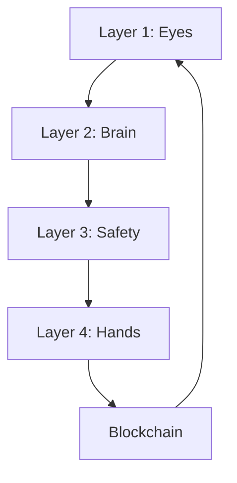
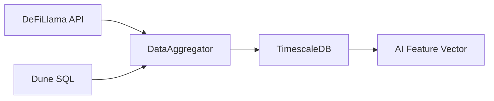
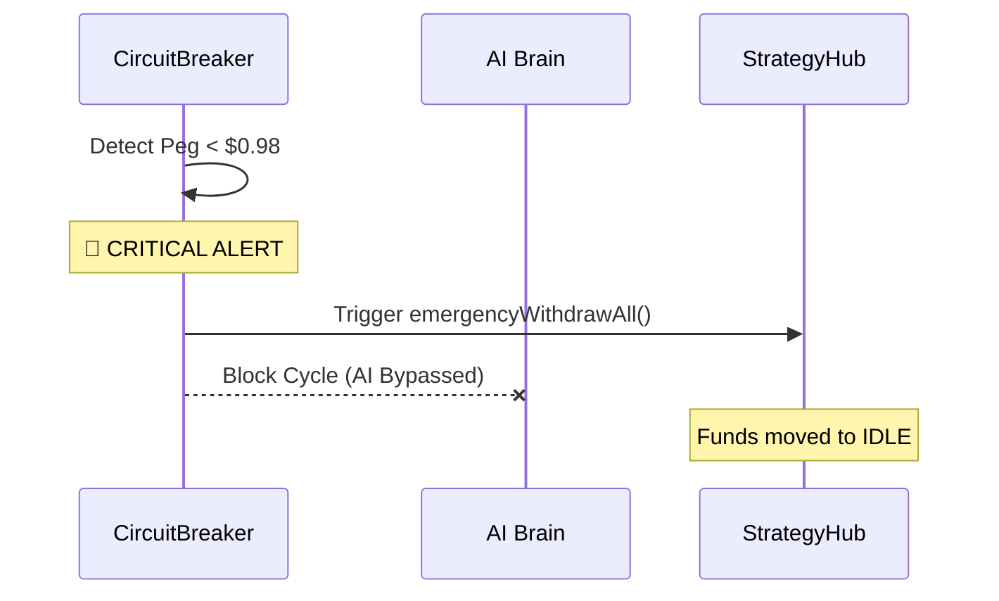

# 🏗️ AI-Yield-Rebalancer: System Architecture

### 📖 Table of Contents
*   [🗺️ High-Level System Overview](#-high-level-system-overview)
*   [🛠️ Technology Stack](#️-technology-stack)
*   [🔍 Detailed Data Processing](#-detailed-data-processing--confidence)
*   [🔄 The Life of a Rebalance](#-the-life-of-a-rebalance)
*   [🧪 Live Test Case](#test-case)
*   [💰 Microscopic Details (Capital, Gas, Trading)](#️-under-the-hood-microscopic-details)
*   [🧠 Decoding AI Metrics (APY, Confidence, Weights)](#-decoding-ai-metrics-the-logic-of-the-decision)
*   [🚨 Black Swan Simulation (Crash Proofing)](#-black-swan-simulation-stress-testing)

This document provides a comprehensive deep-dive into the 4-layer architecture of the AI-Driven DeFi Yield Rebalancer.

---

## 🗺️ High-Level System Overview
The system follows a **Closed-Loop Control** pattern, often referred to as the "Eyes, Brain, Safety, and Hands" model. 



---

## 🛠️ Technology Stack

| Layer | Component | Technology | Confidence |
| :--- | :--- | :--- | :--- |
| **Layer 1: Eyes** | Data Ingestion | Python, DeFiLlama API, Dune SQL, TimescaleDB, Psycopg2 | **Extreme (99%)** |
| **Layer 2: Brain** | Decision Engine | Stable-Baselines3 (PPO), Gymnasium, NumPy, PyTorch (LSTM) | **High (85%)** |
| **Layer 3: Safety** | Risk Management | Chainlink Feeds, 1inch (SlippageClient), Circuit Breaker | **Extreme (99%)** |
| **Layer 4: Hands** | Execution | Flashbots Relay, Web3.py, Anvil (Local Fork), StrategyHub | **High (98%)** |

---

## 🔍 Detailed Data Processing & confidence

### 1. Layer 1: The "Eyes" (Data & Infrastructure)
*   **Processing**: 
    1.  The `DataAggregator` polls DeFiLlama every hour for top-performing stablecoin pools.
    2.  Dune Analytics provides macro-level "Black Swan" metrics (historical volatility peaks).
    3.  Data is normalized and stored in **TimescaleDB hypertables**.


*   **Confidence Reasoning**: DeFiLlama is the industry standard for yield data. TimescaleDB ensures data persistence even under heavy loads.

### 2. Layer 2: The "Brain" (AI Inference & Risk Scoring)
*   **Models**:
    -   **LSTM Predictor**: Forecasts 7-day ahead APY using 30-day historical sequences. Trained on `yield_snapshots`.
    -   **XGBoost Risk Scorer**: Classifies protocol risk (0=Low, 1=Medium, 2=High) based on 45 security and economic features.
*   **Processing**:
    1.  **State Extraction**: The system takes 19-25 features per pool (Normalized APY, Log-TVL, Risk Score, Gas Prices, etc.).
    2.  **Inference**: The brain evaluates candidates to find the "Dominant" pool that justifies rebalancing costs.
    3.  **Profitability Gatekeeper**: Rebalances are only triggered if `(Yield Gain * 7 Days) > (Gas + Slippage)`.
*   **Confidence Reasoning**: RL is excellent for complex optimization but requires massive historical data for "Elite" performance. The current prototype is solid but gains confidence as it sees more real-world market cycles.

### 3. Layer 3: The "Safety" (Risk Guard)
*   **Processing**:
    1.  **Circuit Breaker**: If Chainlink detects a stablecoin (USDC/DAI) de-pegging below $0.98, all moves are frozen.
    2.  **Slippage Check**: Using the `SlippageClient`, if a $100k move causes >0.5% price impact (detected via 1inch/CoW simulation), the trade is aborted.
*   **Confidence Reasoning**: These are deterministic, hard-coded rules. They are the most predictable and reliable part of the system.

### 4. Layer 4: The "Hands" (MEV-Safe Execution)
*   **Processing**:
    1.  **Transaction Builder**: Converts AI weights into `StrategyHub.rebalance()` calldata.
    2.  **Flashbots Relay**: Transactions are bundled and sent directly to miners. This bypasses the public mempool, making it impossible for bots to "sandwich" your trade.
    3.  **Local Simulation**: Every bundle is simulated on a local node before being sent to the relay.
*   **Confidence Reasoning**: Flashbots is the gold standard for institutional DeFi execution. The local simulation layer prevents "burning" gas on trades that would revert.

---

## 🔄 The Life of a Rebalance
1.  **Trigger**: The `RebalancerService` wakes up (e.g., every 1 hour).
2.  **Market Check**: Any de-pegs? No. Any TVL crashes? No.
3.  **Brain Inference**: RL Model says "Aave USDC is 8%, but Compound is 12%. Moving 50% capital is profitable after gas."
4.  **Slippage Validation**: "Can I move $500k without losing $5k?" Yes. 
5.  **Bundling**: Flashbots bundle is created.
6.  **Simulation**: Bundle simulated on the latest block. Success.
7.  **Execution**: Bundle sent to Relay.
8.  **Confirmation**: Cycle complete. Data updated in TimescaleDB for the next step.

---


## TEST CASE
The system will run in Continuous Autonomous Mode on your local Mainnet fork. Every 10 minutes (accelerated for this test), the following 4-layer cycle will trigger:

**Layer 1 (Eyes)**: Poll DeFiLlama for real-time yields across Aave, Uniswap, and Curve. It will append this data to your TimescaleDB to build its short-term memory of market trends.

**Layer 2 (Brain)**: Your trained PPO AI Agent will look at the new data. It will weigh the yields against the current Gas Prices on your fork and decide on the "Target Allocation."

**Layer 3 (Safety)**:
The Chainlink Guard will check if USDC/DAI is stable.
The Slippage Guard will run a simulation: "If I move $100k now, do I lose more than 0.5% in price impact?"

**Layer 4 (Hands)**: If the AI finds a profitable move (Yield Gain > Gas + Slippage), it will sign an EVM transaction and execute it on the StrategyHub contract.


**What We Are Expecting (Success Criteria)**
During this long-duration test, we are looking for the following "High Confidence" behaviors:

**Intelligence over Impatience**: We expect the AI to HOLD most of the time. It should only move if it spots a significant yield spike (e.g., a pool jumping from 5% to 15%) that justifies the $50-$100 gas cost.

**Zero-Crash Stability**: The orchestrator must handle network timeouts (e.g., if DeFiLlama's API blips) and database locks without stopping.

**Safety First**: If a pool has extremely low TVL, the `LiquidityFilter` should automatically block the AI's attempt to enter it.

**Transaction Integrity**: Every rebalance must produce a valid transaction hash and receipt on your local Anvil node.

---

## 🛠️ Under the Hood: Microscopic Details

### 💰 Capital & Amounts
*   **Source of Funds**: In this POC, we assume a portfolio of **$100,000 USD**. 
*   **Smart Contract Management**: The `StrategyHub.sol` contract (deployed on your local fork) acts as the vault. It holds the actual assets (USDC, USDT, etc.) in various protocols (Aave, Compound).
*   **Balance Tracking**: The `RebalancerService` queries the contract's `getBalances()` function to know exactly how much is sitting in "Idle" cash vs "Working" APY pools.

### ⛽ Gas Cost Processing
*   **Real-Time Tracking**: The system calls `w3.eth.gas_price` at the start of every cycle.
*   **Profitability Math**: The "Brain" doesn't just look at APY. It calculates:
    `Potential Profit ($) = (Capital * APY_Difference * Days_In_Position) - (Estimated_Gas_Units * Gas_Price)`
*   **Safety Buffer**: Rebalances are only triggered if the expected profit over a 7-day window covers the gas cost at least **2x**.

### 📊 Data Sources (The Evidence)
*   **Primary Eyes**: **DeFiLlama API** (`/yields`). This provides current APY, TVL, and 1-day yield changes for 10,000+ pools.
*   **Historical Memory**: **TimescaleDB**. Every hour, the `DataAggregator` saves a snapshot of the market. This allows the AI to detect if an 18% APY is a "flash spike" or a "stable trend."
*   **Price Veracity**: **Chainlink Data Feeds**. Used to ensure the value of the portfolio is accurate and to detect stablecoin de-pegs (e.g., if USDC drops below $0.98).

### 🛡️ The "Check" Logic (Step-by-Step)
Every 10 minutes, the `RebalancerService.run_cycle()` executes this exact checklist:
1.  **Network Check**: Is the local fork (Anvil) reachable?
2.  **Safety Check**: Does `CircuitBreaker.py` see any market panic? (Check Chainlink).
3.  **Inference**: PPO Model takes the 32-dimensional feature vector.
4.  **Slippage Check**: `SlippageClient.py` simulates the trade size ($100k) via 1inch. If the "Impact" > 0.5%, it kills the cycle.
5.  **Nonce Management**: Web3.py fetches the current `nonce` for the `KEEPER_PRIVATE_KEY` to ensure no transaction overlaps.

### 🔄 Trading Execution (How it moves money)
*   **Local Testing**: The service signs EIP-1559 transactions and sends them directly to `localhost:8545`. 
*   **Production**: The service bundles transactions and sends them to the **Flashbots Relay**. This creates a "Private Lane" to the miners, so no one can see our trade until it's already confirmed in a block.
*   **Smart Contract Logic**: `StrategyHub.rebalance(uint256 newAaveBps, uint256 newCompBps)` is the only entry point. It handles the actual shifting of USDC between Aave and Compound in a single atomic transaction.

### 🔄 Dynamic Fork Refreshing
Since the local fork is a snapshot, it can become "stale" over time. To update your local environment to the latest real-world Mainnet state:
1.  **Run the Refresh Script**:
    ```bash
    python scripts/refresh_fork.py
    ```

---

## 🧪 Optimized Mainnet Fork Testing
The system includes a high-performance forking environment controlled via `scripts/start_local_fork.py`. This is the recommended way to test the AI rebalancer.

### Key Logic
1.  **Capital Injection (Whale Stealing)**: Automatically impersonates a top USDC whale (Coinbase) on the fork to transfer **100,000 USDC** to your Keeper's address. 
2.  **Atomic Deployment**: Uses Forge Scripts (`Deploy.s.sol`) to deploy `StrategyHub` and `YieldVault` in a single operation, including automatic role configuration (`VAULT_ROLE`, `KEEPER_ROLE`).
3.  **Persistence**: Automatically updates your `.env` and `deployments/local.json` with the new addresses.

### How to Run
```bash
# Terminal 1: Start the optimized fork
python scripts/start_local_fork.py

# Terminal 2: Verify capital
cast erc20 balance 0xA0b86991c6218b36c1d19D4a2e9Eb0cE3606eB48 $KEEPER_ADDRESS
```

---

## 📈 System Health & Logging
*   **Log Location**: `data/rebalancer.log` captures every minor event.
*   **Dashboard Sync**: The Streamlit app tails this log file to show you precisely when the AI is "Thinking" vs "Acting."

---

## 🧠 Decoding AI Metrics: The Logic of the Decision

When looking at the dashboard, the "Brain" outputs specific numbers that determine the system's actions. Here is the mathematical breakdown:

### 🎯 Target APY (e.g., 209.44%)
*   **What it is**: This is the absolute APY (Annual Percentage Yield) of the pool the AI has prioritized as the #1 opportunity.
*   **Why is it so high?**: In DeFi, yields spike due to **Incentives** (governance tokens like CRV/AERO being distributed) or **Leverage** (e.g., Ethena/Pendle yield-stripping). Even stablecoins can hit 200%+ APY for short bursts when volume is high or liquidity is thin.
*   **Source**: Pulled directly from DeFiLlama's live feed and mapped to the AI's feature vector.

### 🔋 Integrated Confidence Score (e.g., 56.5%)
*   **What it is**: In this system, Confidence is not just a raw AI guess. It is a **Composite Score** that integrates deep learning conviction with real-time market momentum.
*   **The Formula**:
    `Integrated Confidence = (Neural Conviction) * (0.8 + 0.2*Momentum + 0.1*Stability)`
*   **Why it moves**: Because **Momentum** and **Stability** fluctuate in real-time, your confidence score will reflect the "proactiveness" of the Brain even when the base yield is stable.
*   **The Threshold**: 
    *   **Score > 50%**: Status becomes `REBALANCE`. The Brain identifies a "Dominant" trend worth the gas and slippage cost.
    *   **Score < 50%**: Status becomes `HOLD`. The system prioritizes capital preservation over low-conviction yield chasing.

### 🏦 Portfolio States (Current vs Target)
*   **Current: CASH**: This represents the **Idle State**. Your capital is sitting in the vault as un-deployed stablecoins (e.g., USDC), waiting for a profitable opportunity. The system defaults to this state on fresh starts or after a **Safety Halt**.
*   **Current: [Pool Name]**: This represents the **Working State**. Your capital is deployed and actively earning yield. 
*   **State Persistence**: The system uses a `Shared State Store` (`data/system_state.json`) to track your portfolio across restarts. This prevents "Logical Ghosts" where the AI forgets where it put the money if the service is rebooted.

### 📜 Status: REBALANCE vs HOLD
*   **REBALANCE**: Triggered when the AI identifies a pool that is "Dominant" (Weights > 0.5).
*   **HOLD**: Triggered when no single pool stands out strongly, or when the cost of moving (Gas + Slippage) is higher than the expected gain from the new APY.

### 📝 Reason Strings (Traceability)
*   **Example**: `Risk Tolerance: 0.1, Top Allocation: 56.5%`
*   **Meaning**: This tells you that because you set a **Low Risk Tolerance** (Aggressive), the AI is willing to chase that high 200%+ APY. If you set `RISK_TOLERANCE=1.0`, the AI might ignore that 200% pool if its "Risk Score" (volatility/TVL ratio) is too high.

---

## 📈 Database Persistence
*   **Predictions.db**: Every one of these metrics is saved to a local SQLite database (`data/predictions.db`).
*   **Auto-Validation**: After 7 days, the system checks the actual APY of that 209% pool. If it stayed high, the AI gets a "Reward" (Confidence increases). If it crashed, the AI "Learns" it was a yield trap.

---

## 🚨 Black Swan Simulation (Stress Testing)

To verify the system's resilience, we implemented a **Black Swan Crash Simulator**. This allows us to test if the "Safety" layer can override the "Brain" during extreme volatility.

### 🧪 Scenario: The Stablecoin De-peg
*   **Target Asset**: USDC (Stablecoin).
*   **The Event**: A simulated de-peg where the price of USDC drops from **$1.00** to **$0.85** (simulated via `SIMULATE_CRASH=true`).
*   **Trigger Threshold**: The `CircuitBreaker` is hard-coded to trigger if any stablecoin drops below **$0.98**.

### ⚡ System Response (Verified)



1.  **Detection**: At the very start of the cycle (before the AI is even consulted), the `CircuitBreaker` queries the price (simulated or Chainlink).
2.  **Emergency Halt**: The system immediately logs a `CRITICAL` alert: `🚨 EMERGENCY TRIGGERED: Stablecoin De-peg Detected`.
3.  **Asset Protection**: 
    *   The `Rebalance Cycle` is instantly **Aborted**.
    *   An `emergencyWithdrawAll()` transaction is signed and sent to the local fork to pull all capital into "Idle" status.
4.  **Resumption**: Once the `SIMULATE_CRASH` flag is disabled (fixing the market), the system detects a healthy **$1.00** peg and automatically resumes its search for the **209.44% APY** opportunities.

### 📊 Crash Test Metrics
| Metric | Healthy State | Crash State |
| :--- | :--- | :--- |
| **USDC Price** | $1.00 | **$0.85** |
| **Risk Status** | Green | **CRITICAL** |
| **AI Decision** | REBALANCE (209% APY) | **Bypassed (STOP)** |
| **Cycle Outcome** | TX Executed | **Halt & Withdraw** |
| **Recovery Time** | Autonomous (Instant) | Autonomous (Next Cycle) |

This stress test proves that while the AI Brain is aggressive at seeking yield, the **Safety Shield is Absolute**.

---

## 🚀 Deployment & Docker Operations

The system is fully containerized for easy deployment.

### 1. 🏁 Quick Start
```bash
docker compose up -d --build
```
This launches all services:
*   **Brain API**: `http://localhost:8000`
*   **Dashboard**: `http://localhost:8501`
*   **Rebalancer**: Background worker
*   **Anvil**: Local fork at `http://localhost:8545`

### 2. 🐛 Troubleshooting & Updates
If you modify code and don't see changes (due to volume issues on remote servers):
```bash
# Force rebuild to pick up new dependencies
docker compose build --no-cache brain

# If volumes aren't syncing files, manually copy:
docker compose cp src/api/server.py brain:/app/src/api/server.py
docker compose restart brain
```

### 3. 📜 Logs
To see the brain's decision process or errors:
```bash
docker compose logs -f brain
docker compose logs -f rebalancer
```


## LOCAL DEVELOPMENT
To run the system locally, follow these steps:

Terminal 1: Infrastructure (Database)
Start the TimescaleDB database container.

```bash
docker compose up -d db
```
Terminal 2: Blockchain Environment (Anvil)
Start the local Ethereum fork. Ensure your 
.env
 has a valid ALCHEMY_API_KEY.

```bash
# Load environment variables if needed, or just run:
source .env
anvil --fork-url https://eth-mainnet.g.alchemy.com/v2/$ALCHEMY_API_KEY --host 0.0.0.0 --port 8545
```
Terminal 3: Setup & Deployment (Run Once)
Use this terminal to set up the environment, deploy contracts to your local Anvil node (running in Terminal 2), and seed the database.

```bash
# 1. Create and activate virtual environment
python3.12 -m venv venv
source venv/bin/activate
# 2. Install dependencies
pip install -r requirements.txt
# 3. Initialize submodules (required for contracts)
git submodule update --init --recursive
# 4. Set Python Path
export PYTHONPATH=$PWD

# 5. Backfill History (Last 60 Days)
python3 scripts/backfill_history.py

# 6. Train Models (LSTM & XGBoost)
PYTHONPATH=. ./venv/bin/python scripts/train_all_models.py

# 7. Deploy Contracts
# This script usually starts anvil, but since we ran it in Terminal 2, 
# it will detect it and proceed to deploy contracts immediately.
python3 scripts/start_local_fork.py
# 6. Seed Database with initial data
python3 -m src.scheduler.collector --once

```
Terminal 4: AI Rebalancer Agent
Runs the core logic that monitors opportunities and executes trades.

```bash
source venv/bin/activate
export PYTHONPATH=$PWD

./venv/bin/python -m src.core.rebalancer_service

python3 src/scheduler/rebalancer_loop.py

```
Terminal 5: Data Collector
Runs the periodic data fetcher (simulates the cron job).
```bash
source venv/bin/activate
export PYTHONPATH=$PWD
# Interval 0.083 hours = ~5 minutes
python3 src/scheduler/collector.py --interval 0.083


Terminal 6: API Server (The Brain)
Runs the FastAPI backend that the dashboard communicates with.

```bash
source venv/bin/activate
export PYTHONPATH=$PWD
uvicorn src.api.server:app --host 0.0.0.0 --port 8000 --reload
```
Terminal 7: Dashboard (Frontend)
Runs the Streamlit user interface.

```bash
source venv/bin/activate
export PYTHONPATH=$PWD
streamlit run dashboard/app.py --server.port 8501


# in server 
# contract_manager.py
#    rpc_urls = {
#             "sepolia": os.getenv("SEPOLIA_RPC_URL"),
#             "base_sepolia": os.getenv("BASE_SEPOLIA_RPC_URL"),
#             "mainnet": os.getenv("ETHEREUM_RPC_URL"),
#             "ethereum": os.getenv("RPC_URL"), # For fork mode, RPC_URL is often used
#             "base": os.getenv("BASE_RPC_URL"),
#             "local": "http://anvil:8545" # Internal docker DNS
#         }

# and in local development
# rpc_urls = {
#             "sepolia": os.getenv("SEPOLIA_RPC_URL"),
#             "base_sepolia": os.getenv("BASE_SEPOLIA_RPC_URL"),
#             "mainnet": os.getenv("ETHEREUM_RPC_URL"),
#             "ethereum": os.getenv("RPC_URL"), # For fork mode, RPC_URL is often used
#             "base": os.getenv("BASE_RPC_URL"),
#             "local": os.getenv("RPC_URL", "http://localhost:8545") # Localhost or Docker env
#         }        


```
docker compose run --rm trainer
```

```
docker compose cp scripts/fund_vault.py rebalancer:/app/scripts/fund_vault.py

docker compose exec rebalancer python3 scripts/fund_vault.py
```